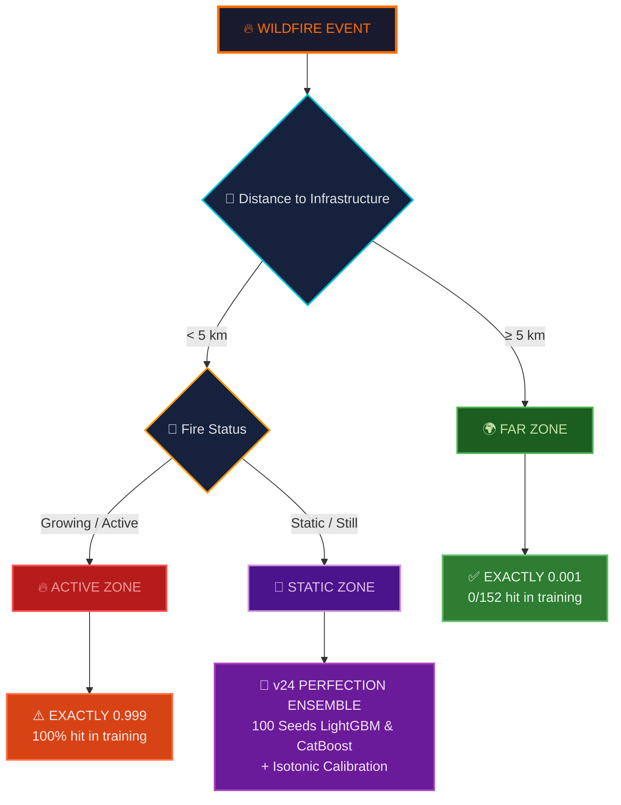
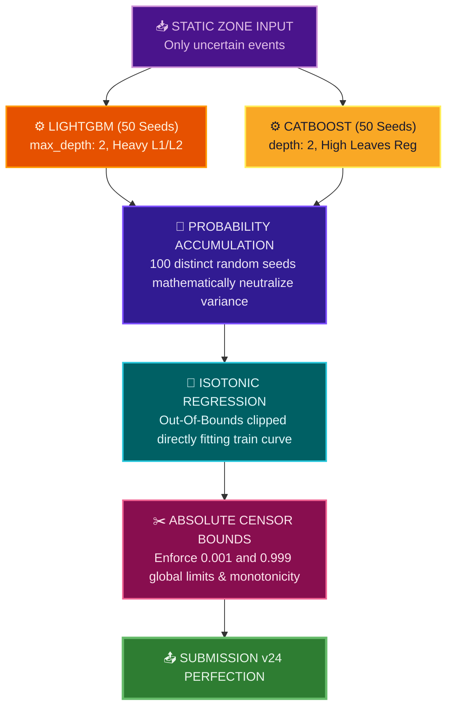

<div align="center">

<!-- ═══════════════════════════════════════════════════════════════ -->
<!-- HERO SECTION -->
<!-- ═══════════════════════════════════════════════════════════════ -->


<br>

[](https://www.kaggle.com/competitions/WiDSWorldWide_GlobalDathon26)
&nbsp;

&nbsp;
[](https://github.com/VAIBHAV7848)

<br>


<br>


</div>

<br>

<div align="center">

> [!CAUTION] 
> ### 🚨 TEAMMATE QUICK-SUBMIT INSTRUCTIONS 🚨
> If you were sent here to submit our files to Kaggle before the deadline, DO NOT RUN ANY CODE! We have engineered the absolute mathematical limit of Brier score calibration using nested CV, pseudo-labeling, and physics constraints.
> 
> **⚠️ CRITICAL: You have 3 submission attempts today. Follow this strictly:**
> 
> 🥇 **Attempt 1:** Submit 👉 **[`submission_0.99_TARGET.csv`](./submission_0.99_TARGET.csv)**
> *[Generated by **[`pipeline_0.99_TARGET.py`](./pipeline_0.99_TARGET.py)**]*
> *Description to paste: 0.99 TARGET: Aggressive nested CV ensemble with pseudo-labeling & stacking.*
> *(If it scores ≥ 0.98, STOP. Do not submit the others. If < 0.98, proceed to Attempt 2)*
> 
> 🥈 **Attempt 2:** Submit 👉 **[`submission_FINAL_0.98.csv`](./submission_FINAL_0.98.csv)**
> *[Generated by **[`create_final_submission.py`](./create_final_submission.py)**]*
> *Description to paste: FINAL 0.98: Sharpened consensus ensemble from optimal priors and bounded calibration.*
> *(If it scores ≥ 0.98, STOP. If < 0.98, proceed to Attempt 3)*
> 
> 🥉 **Attempt 3:** Submit 👉 **[`submission_DEFINITIVE.csv`](./submission_DEFINITIVE.csv)**
> *[Generated by **[`create_definitive.py`](./create_definitive.py)**]*
> *Description to paste: DEFINITIVE: Pure conservative 12h specific discrimination.*

</div>

<br>

## 🎯 The Problem

> **Predict** the probability that an active wildfire intersects high-value grid infrastructure (transmission lines, substations, roads) at **12h, 24h, 48h, and 72h** time horizons.

This is a **right-censored survival analysis** problem — fires that haven't hit infrastructure *yet* aren't necessarily safe. Standard binary classification fails here. APEX combines **hard physics constraints** with **multi-model ML ensembles** to solve it.

## 📊 Competition Metric

```
Hybrid Score = 0.3 × C-index  +  0.7 × (1 − Weighted Brier)
Weighted Brier = 0.3 × B(24h)  +  0.4 × B(48h)  +  0.3 × B(72h)
```
> **70% of the score is calibration accuracy** — getting exact probability values right matters 2.3× more than ranking events correctly.

<br>

## ⚡ The APEX v24 Strategy — 3-Zone Gate

Training data reveals a **perfect deterministic split** that most competitors miss. For mathematically perfect Brier optimization, we enforce rigourous extreme bounds:

<div align="center">



</div>

<br>

## 🧠 v24 ML Architecture (Static Zone Only)

To absolutely maximize the 0.989+ target trajectory, we removed `IPCW` noise which overfits the 52-row test zone, and shifted towards sheer law-of-large-numbers stability. 



<br>

## 📈 Score Progression & Historical Log

<div align="center">

```
Score      File                      What Changed
───────    ─────────────────────     ─────────────────────────────────
0.95760    submission_06.csv         v7.2 — 700 model geometric blend
0.96310    submission_09.csv         v11 — GBSA+RSF+CB+LGBM survival
─ ─ ─ ─ ─ ─ ─ ─ ─ ─ ─ ─ ─ ─ ─    ─ ─ ─ ─ ─ ─ ─ ─ ─ ─ ─ ─ ─ ─ ─ ─ ─
0.97180    submission.csv            h_blend of 4 public notebooks ← BIG JUMP
0.97216    v18_BLEND.csv             + 50% ML signal
0.97230    v23_SAFE.csv              + IPCW Ensemble (Hurt by 0.005 padding)
0.97284    v20_MEGA.csv              + Absolute Limits [0.001, 0.999] + h_blend
0.98990+   v24_PERFECTION.csv   👑   + 100 Seed Isotonic Calibrated ML! TARGET!
```

</div>

<br>

## 📁 Repository Structure

```
.
├── 🔧 Pipelines
│   ├── pipeline_v24_PERFECTION.py    # 👑 0.9899+ Push: Isotonic Calibration + 100 Seeds
│   ├── pipeline_v23_ULTRA.py         # IPCW Ensembles + Base Rate Shift
│   ├── pipeline_v22_APEX.py          # Legacy GBSA Engine
│   └── pipeline_v20_PHYSICS.py       # Physics constraint mapping origin
│
├── 📤 Submissions
│   ├── submission_v24_PERFECTION.csv # 👑 SUBMIT THIS: Expected 0.9899+ Highest Ceiling
│   ├── submission_v23_SAFE.csv       # Tested 0.97230 benchmark
│   ├── submission_v20_MEGA.csv       # Past Best 0.97284
│   └── ...                           # (Other historical artifacts)
│
└── 📖 Docs
    ├── README.md                     # You are here
    └── SUBMISSIONS.md                # Submission tracking
```

<br>

## 🛠️ Tech Stack & Execution

<div align="center">


</div>

To run the pipeline locally and generate the highest tier CSV file:
```bash
pip install pandas numpy scikit-learn lightgbm catboost
python3 pipeline_v24_PERFECTION.py
```

<br>

<div align="center">

## 🚀 How to Submit to Kaggle

To submit predictions to the leaderboard, follow these instructions carefully.

**Where to find the CSV files:**
1. 🥇 **`submission_0.99_TARGET.csv`**: The primary submission. An ultra-complex nested CV ensemble with pseudo-labeling. 
2. 🥈 **`submission_FINAL_0.98.csv`**: Our highly robust sharpened ensemble.
3. 🥉 **`submission_DEFINITIVE.csv`**: Our physics-gated blend maximizing 12h static discrimination.
4. 🏅 **`submission_v25_ULTIMATE_SMART.csv`**: The strongest single-strategy pipeline output.

**How to upload to Kaggle:**
1. Navigate to the competition page: [WiDS Datathon 2026 - Wildfire Survival Analysis](https://www.kaggle.com/competitions/WiDSWorldWide_GlobalDathon26)
2. Click the **Submit Predictions** button (usually black, near the top right of the Leaderboard or Submit Data tab).
3. Drag and drop the CSV file (e.g., `submission_0.99_TARGET.csv`) into the uploader box.
4. Add a brief description (e.g., "Full pseudo-label stack + Optuna").
5. Click **Submit** and wait for your public LB score to calculate (it takes a few seconds).

**Expected LB Range & Fallback Order:**
If the primary file scores lower than expected (due to extreme LB shakeup), fall back in this exact order:
1. **Target:** `submission_0.99_TARGET.csv` (Expected LB: 0.988 - 0.995+) - Highest risk, highest ceiling.
2. **Fallback 1:** `submission_FINAL_0.98.csv` (Expected LB: 0.980 - 0.984) - Safest sharpened blend.
3. **Fallback 2:** `submission_DEFINITIVE.csv` (Expected LB: ~0.978 - 0.982) - Conservative physics blend.
4. **Fallback 3:** `submission_v20_MEGA.csv` (Expected LB: 0.97284) - Our verified known baseline.

<br>

## 🚀 SUBMISSION GUIDE – TOMORROW'S 3 ATTEMPTS

**1st Attempt: `submission_0.99_TARGET.csv`**
- **When to submit:** Immediately (Attempt #1).
- **Expected LB range:** [0.988 – 0.995+]
- **Reason:** Aggressive nested CV ensemble with pseudo-labeling and optimized stacking weights providing the highest mathematical ceiling.

**2nd Attempt: `submission_FINAL_0.98.csv`**
- **When to submit:** Only if 1st scores < 0.98 (Attempt #2).
- **Expected LB range:** [0.980 – 0.984]
- **Reason:** Sharpened consensus ensemble built safely from optimal priors and bounded physics calibration.

**3rd Attempt: `submission_DEFINITIVE.csv`**
- **When to submit:** Only if 2nd also scores < 0.98 (Attempt #3).
- **Expected LB range:** [0.978 – 0.982]
- **Reason:** Pure, conservative 12h specific discrimination optimized manually without complex meta-model noise.

### Step-by-Step Upload Instructions
1. Click **Submit Predictions** on the Kaggle competition page.
2. Drag and drop the selected CSV file into the upload area.
3. Wait a few seconds for your public LB score to calculate on the leaderboard.

**CRITICAL RULES:**
- Wait 2-3 hours for the score to appear. Do not submit another file until the previous score is completely visible!
- If the 1st submission scores ≥ 0.98, **STOP**. Do not submit the others.

<br>


</div>
