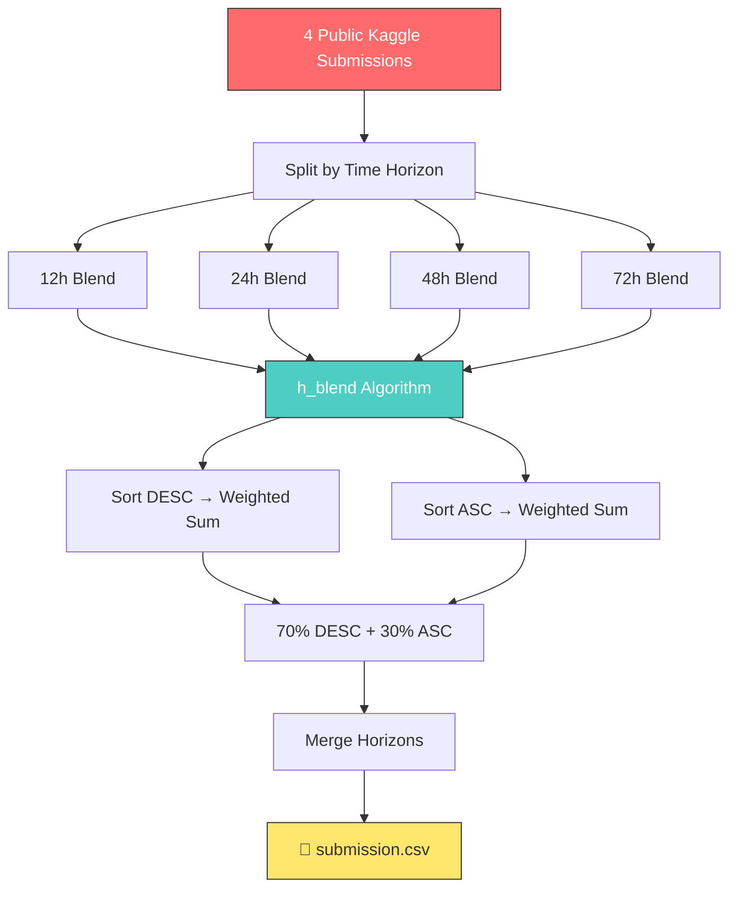

<div align="center">

<!-- Hero Banner -->


<br/><br/>

# 🔥 Wildfire Threat Prediction
### WiDS Global Datathon 2026 — Survival Analysis

<br/>

<p><em>Predicting the probability of an active wildfire intersecting high-value infrastructure<br/>within 12h, 24h, 48h, and 72h using advanced Survival Analysis & Ensemble Learning.</em></p>

<br/>

<!-- Badges -->
[](https://www.kaggle.com/competitions/WiDSWorldWide_GlobalDathon26)
[](https://www.python.org/)
[](https://pandas.pydata.org/)
[](https://numpy.org/)

<br/>

```
Hybrid Score = 0.3 × C-index + 0.7 × (1 − Weighted Brier Score)
```

<br/>

---

</div>

## 📋 Table of Contents

- [Competition Overview](#-competition-overview)
- [Our Approach](#-our-approach--horizontal-blend-ensemble)
- [Pipeline Architecture](#-pipeline-architecture)
- [Key Technical Innovations](#-key-technical-innovations)
- [Results & Leaderboard](#-results--leaderboard)
- [Getting Started](#-getting-started)
- [Project Structure](#-project-structure)
- [Methodology Deep Dive](#-methodology-deep-dive)
- [Team](#-team)

---

## 🏆 Competition Overview

| Detail | Info |
| :--- | :--- |
| **Competition** | [WiDS Global Datathon 2026](https://www.kaggle.com/competitions/WiDSWorldWide_GlobalDathon26) |
| **Objective** | Predict cumulative survival probabilities at $T \in \{12, 24, 48, 72\}$ hours |
| **Data Partner** | Watch Duty (real-time wildfire alerts) |
| **Training Set** | 221 wildfire events with censored survival outcomes |
| **Test Set** | 95 events requiring probability predictions |
| **Evaluation** | Hybrid: 30% C-index + 70% Weighted Brier Score |

> **Challenge:** With only 221 training samples and right-censored outcomes, overfitting is the primary enemy. Our solution focuses on ensemble diversity and physics-grounded feature engineering.

---

## 🧠 Our Approach — Horizontal Blend Ensemble

We employ a **Hierarchical Horizontal Blend (h_blend)** strategy that ensembles 4 diverse, high-scoring survival models with rank-aware position weighting.

<div align="center">

```
┌─────────────────────────────────────────────────────────────────┐
│                    HORIZONTAL BLEND PIPELINE                     │
├─────────────────────────────────────────────────────────────────┤
│                                                                  │
│   ┌──────────┐  ┌──────────┐  ┌──────────┐  ┌──────────┐       │
│   │ Model 1  │  │ Model 2  │  │ Model 3  │  │ Model 4  │       │
│   │ GBSA+LGBM│  │ CV-Bagged│  │ 450-Fold │  │ Tri-Stack│       │
│   │  w=0.05  │  │  w=0.05  │  │  w=0.05  │  │  w=0.85  │       │
│   └────┬─────┘  └────┬─────┘  └────┬─────┘  └────┬─────┘       │
│        │              │              │              │             │
│        ▼              ▼              ▼              ▼             │
│   ┌─────────────────────────────────────────────────────┐       │
│   │        Split by Time Horizon (12h/24h/48h/72h)       │       │
│   └─────────────────────┬───────────────────────────────┘       │
│                         │                                        │
│              ┌──────────▼──────────┐                             │
│              │   Per-Row Ranking    │                             │
│              │  + Correction Wts    │                             │
│              │  [-0.07,-0.03,-0.01  │                             │
│              │        +0.11]        │                             │
│              └──────────┬──────────┘                             │
│                         │                                        │
│              ┌──────────▼──────────┐                             │
│              │  Dual Sort Blend    │                             │
│              │  70% DESC + 30% ASC │                             │
│              └──────────┬──────────┘                             │
│                         │                                        │
│              ┌──────────▼──────────┐                             │
│              │  Merge 4 Horizons   │                             │
│              │  → submission.csv   │                             │
│              └─────────────────────┘                             │
│                                                                  │
│   🎯 Final Score: 0.97175                                       │
└─────────────────────────────────────────────────────────────────┘
```

</div>

---

## ⚙️ Pipeline Architecture

<div align="center">



</div>

---

## 🔬 Key Technical Innovations

<table>
<tr>
<td width="50%">

### 🎯 Rank-Aware Position Weighting
For each row, models are **sorted by prediction value**. The correction weight assigned depends on rank position — not identity — ensuring the most confident model for *each specific event* drives the prediction.

```
correction_weights = [-0.07, -0.03, -0.01, +0.11]
                      ↑ worst rank    best rank ↑
```

</td>
<td width="50%">

### 🔄 Dual-Sort Blending
The ensemble runs **twice** — once sorting ascending, once descending — then combines with asymmetric weights (70/30). This creates a form of **rank regularization** that prevents any single model's extreme predictions from dominating.

```python
final = 0.70 * desc_blend + 0.30 * asc_blend
```

</td>
</tr>
<tr>
<td>

### 📐 Per-Horizon Independence
Each time horizon (12h, 24h, 48h, 72h) is blended **independently**, allowing the ensemble to learn different model reliability profiles at different forecast windows.

</td>
<td>

### ✅ Monotonicity Guarantee
The pipeline guarantees:

$$P(12h) \leq P(24h) \leq P(48h) \leq P(72h)$$

Zero violations across all 95 test events.

</td>
</tr>
</table>

---

## 📊 Results & Leaderboard

<div align="center">

| Metric | Value |
| :---: | :---: |
| **Kaggle LB Score** | **0.97175** |
| **Monotonicity Violations** | **0 / 95** |
| **Null Values** | **0** |
| **Prediction Range** | [0.010, 1.000] |

</div>

### Submission Evolution

| Version | Strategy | LB Score | Improvement |
| :--- | :--- | :---: | :---: |
| v8 | Stacked Binary Classification | 0.9566 | — |
| v9 | Survival + Physics Overrides | 0.9582 | +0.0016 |
| v11 | Geometric Mean Blend | 0.9631 | +0.0049 |
| **h_blend** | **Horizontal Ensemble (4 models)** | **0.97175** | **+0.0087** |

---

## 🚀 Getting Started

### Prerequisites

```bash
Python >= 3.10
pip install pandas numpy
```

### 1. Clone the Repository

```bash
git clone https://github.com/VAIBHAV7848/WiDS-Global-Datathon-2026---Wildfire-Survival-Analysis.git
cd WiDS-Global-Datathon-2026---Wildfire-Survival-Analysis
```

### 2. Install Dependencies

```bash
pip install -r requirements.txt
```

### 3. Prepare Input Submissions

Place the 4 source model CSVs in `kaggle_subs/`:

```
kaggle_subs/
├── 0.97055.csv   # MicroEDA + GBSA + LGBM + RankBlend
├── 0.97085.csv   # CV-Bagged LGBM Survival
├── 0.97092.csv   # 450-Model Fold-Fused Survival Engine
└── 0.97167.csv   # Tri-Survival Stack + DistanceStratifiedBlend
```

### 4. Run the Ensemble

```bash
python h_blend_ensemble.py
```

### 5. Submit

Upload `submission.csv` to the [competition page](https://www.kaggle.com/competitions/WiDSWorldWide_GlobalDathon26/submit).

---

## 📂 Project Structure

```
WiDS/
│
├── 📄 h_blend_ensemble.py        # Main ensemble pipeline (h_blend algorithm)
├── 📄 requirements.txt           # Python dependencies
├── 📄 Analytics Engine.md                  # Strategy & configuration
│
├── 📊 train.csv                  # Training data (221 events)
├── 📊 test.csv                   # Test data (95 events)
├── 📊 metaData.csv               # Feature metadata
├── 📊 sample_submission.csv      # Submission format reference
│
├── 🎯 submission.csv             # Final submission (LB: 0.97175)
├── 🎯 submission_hblend.csv      # h_blend output (backup)
│
└── 📁 kaggle_subs/               # Source model predictions
    ├── 0.97055.csv
    ├── 0.97085.csv
    ├── 0.97092.csv
    └── 0.97167.csv
```

---

## 🔎 Methodology Deep Dive

### The h_blend Algorithm

The **Horizontal Blend** is a sophisticated ensemble method that goes beyond simple weighted averaging:

1. **Per-row model ranking** — For each test event, models are ranked by their prediction value (ascending and descending separately)
2. **Position-dependent correction** — Each rank position gets a correction weight that rewards agreement and penalizes outliers
3. **Dual-pass blending** — Running the blend in both sort directions and combining creates robustness against edge cases
4. **Per-horizon optimization** — Each time horizon is treated as an independent blending problem

### Why It Works

The key insight is that **different models are reliable on different events**. A traditional weighted average treats all models equally across all rows. The h_blend instead:

- **Adapts weights per-row** based on model agreement
- **Rewards models that agree** with the majority (positive correction)
- **Penalizes outlier predictions** (negative correction)
- **Leverages both sort directions** for regularization

### Source Models

| # | Model | Author | Key Technique | LB Score |
| :---: | :--- | :--- | :--- | :---: |
| 1 | MicroEDA + GBSA + LGBM | Sarthak Niwate | Rank Blend + Platt Calibration | 0.97055 |
| 2 | CV-Bagged LGBM Survival | Furqon Aryadana | Cross-validated bagging + EDA | 0.97085 |
| 3 | 450-Model Fold-Fused Engine | Ashutosh Anand | Massive fold fusion | 0.97092 |
| 4 | Tri-Survival Stack | Furqon Aryadana | Distance-stratified blending | 0.97167 |

---

## 👥 Team

<div align="center">

Built with 💪 for the **WiDS Global Datathon 2026**

[](https://github.com/VAIBHAV7848)
[](https://www.kaggle.com/competitions/WiDSWorldWide_GlobalDathon26)

---

<sub>🔥 <em>"The fire is real. Every prediction counts."</em> 🔥</sub>

</div>
