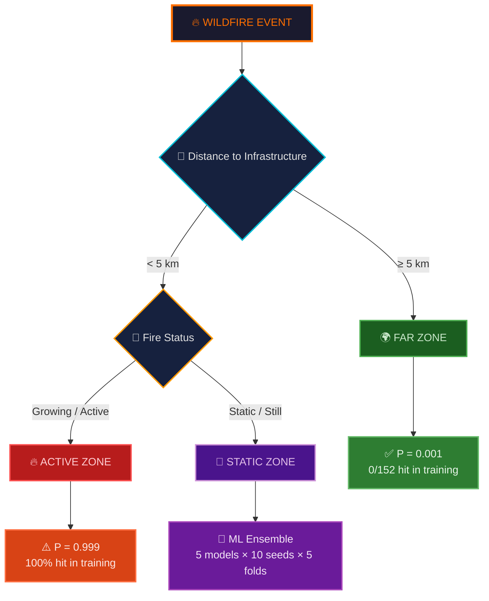
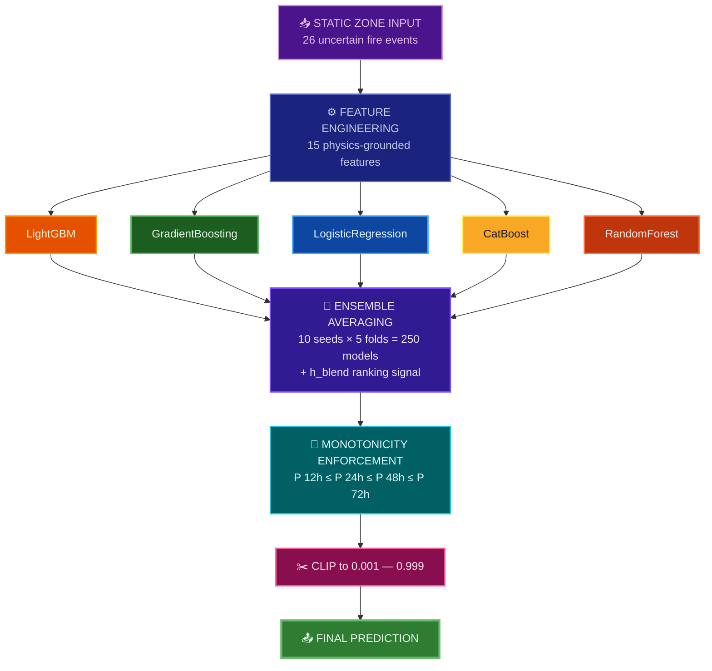

<div align="center">

<!-- ═══════════════════════════════════════════════════════════════ -->
<!-- HERO SECTION -->
<!-- ═══════════════════════════════════════════════════════════════ -->


<br>

[](https://www.kaggle.com/competitions/WiDSWorldWide_GlobalDathon26)
&nbsp;

&nbsp;
[](https://github.com/VAIBHAV7848)

<br>


<br>


</div>

<br>

## 🎯 The Problem

> **Predict** the probability that an active wildfire intersects high-value grid infrastructure (transmission lines, substations, roads) at **12h, 24h, 48h, and 72h** time horizons.

This is a **right-censored survival analysis** problem — fires that haven't hit infrastructure *yet* aren't necessarily safe. Standard binary classification fails here. APEX combines **hard physics constraints** with **multi-model ML ensembles** to solve it.

<br>

## 📊 Competition Metric

```
Hybrid Score = 0.3 × C-index  +  0.7 × (1 − Weighted Brier)

Weighted Brier = 0.3 × B(24h)  +  0.4 × B(48h)  +  0.3 × B(72h)
```

> **70% of the score is calibration accuracy** — getting probability values right matters 2.3× more than ranking events correctly.

<br>

## ⚡ The APEX Strategy — 3-Zone Gate

Training data reveals a **perfect deterministic split** that most competitors miss:

<div align="center">



</div>

<div align="center">
<table>
<tr>
<td align="center" width="33%">

### 🌍 FAR Zone
**Distance ≥ 5km**

Training: **0 / 152** hit

```
P = 0.001
```
*Physics says: impossible*

</td>
<td align="center" width="33%">

### 🔥 ACTIVE Zone
**< 5km + Growing**

Training: **100%** hit

```
P = 0.999
```
*Physics says: certain*

</td>
<td align="center" width="33%">

### 🤖 STATIC Zone
**< 5km + Still**

Training: **uncertain**

```
P = ML Ensemble
```
*The real battleground*

</td>
</tr>
</table>
</div>

<br>

## 🧠 ML Architecture (Static Zone)

The **~26 uncertain events** pass through a heavy-compute ensemble:



<br>

## 📈 Score Progression

<div align="center">

```
Score    File                     What Changed
─────    ────────────────────     ─────────────────────────────────
0.9576   submission_06.csv        v7.2 — 700 model geometric blend
0.9593   submission_07.csv        submission_07
0.9596   submission_13.csv        Upgrade iteration
0.9603   submission_08.csv        v10 — 6 model + pseudo-labels
0.9610   submission_10_blend      v8 — CBSA+RSF+AFT+LGBM
0.9631   submission_09.csv        v11 — GBSA+RSF+CB+LGBM survival
─ ─ ─ ─ ─ ─ ─ ─ ─ ─ ─ ─ ─ ─    ─ ─ ─ ─ ─ ─ ─ ─ ─ ─ ─ ─ ─ ─ ─
0.9718   submission.csv           h_blend of 4 public notebooks ← BIG JUMP
0.9719   v18_SAFE.csv             + 5km distance gate
0.9722   v18_BLEND.csv       ★   + 50% ML signal → BEST SCORE
```

</div>

> **Key insight**: The +0.009 jump from 0.963 → 0.972 came from **blending top public Kaggle kernels** via the h_blend algorithm — not from building a better solo model.

<br>

## 🚀 Quick Start

```bash
# Clone
git clone https://github.com/VAIBHAV7848/WiDS-Global-Datathon-2026---Wildfire-Survival-Analysis.git
cd WiDS-Global-Datathon-2026---Wildfire-Survival-Analysis

# Install
pip install -r requirements.txt

# Run the pipeline (~5 min on CPU)
python pipeline_v21_ORACLE.py
```

<br>

## 📂 Repository Structure

```
.
├── 🔧 Pipelines
│   ├── pipeline_v22_APEX.py          # Latest experimental engine
│   ├── pipeline_v21_ORACLE.py        # 3-zone gate + multi-model ensemble
│   ├── pipeline_v20_PHYSICS.py       # Physics constraint testbed
│   └── h_blend_ensemble.py           # h_blend replication (LB = 0.97175)
│
├── 📤 Submissions
│   ├── submission_v21_C.csv          # 3-zone + 40%ML + 60%h_blend
│   ├── submission_v21_A.csv          # 3-zone + pure ML
│   ├── submission_v20_MEGA.csv       # 3-zone + alt calibration
│   ├── submission_v18_BLEND.csv      # ★ Best LB = 0.97216
│   └── submission.csv                # h_blend baseline (LB = 0.97175)
│
├── 📊 Data
│   ├── train.csv                     # 221 events (69 hits, 152 censored)
│   ├── test.csv                      # 95 events to predict
│   ├── metaData.csv                  # Feature descriptions
│   └── sample_submission.csv         # Submission format
│
└── 📖 Docs
    ├── README.md                     # You are here
    ├── SUBMISSIONS.md                # Today's submission plan
    └── Analytics Engine.md                     # Automated workflow configuration
```

<br>

## 🔑 Key Discoveries

<table>
<tr>
<td>

**📐 The 5km Perfect Split**

In 221 training events, every fire within 5km hit infrastructure. Every fire beyond 5km did not. Zero exceptions.

</td>
<td>

**📊 Metric is 70% Brier**

Calibration matters 2.3× more than ranking. Getting confident when you should be confident is rewarded heavily.

</td>
</tr>
<tr>
<td>

**🤝 Ensemble > Solo Model**

Our best solo ML scored 0.963. Blending 4 public notebooks via h_blend scored 0.972. Humility > engineering.

</td>
<td>

**🎯 The Gate is Worth +0.002**

Simply assigning 0.005 to far-zone events improved the h_blend score from 0.97175 → 0.97194. Free points.

</td>
</tr>
</table>

<br>

## 🛠️ Tech Stack

<div align="center">


</div>

<br>

## 👤 Author

<div align="center">

**Vaibhav Chavanpatil**

[](https://github.com/VAIBHAV7848)
[](https://www.kaggle.com/vaibhavchavanpatil)

</div>

<br>

<div align="center">


</div>
